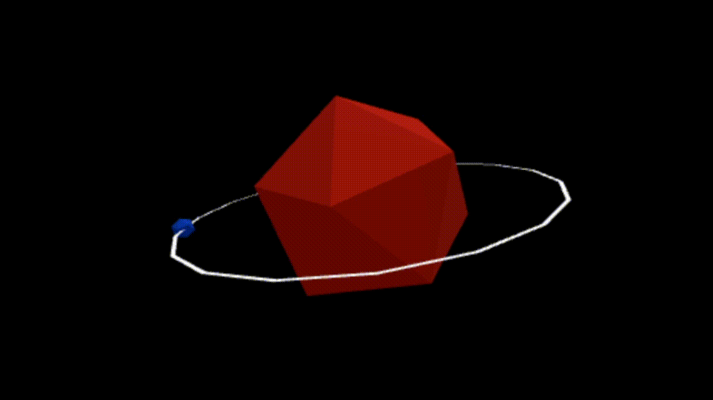

# 🛝 Computer Graphics Playground

This repository is where I store experimental codes while I learn about Computer Graphics. It includes everything from shader test codes to building geometric shapes using ThreeJS. Feel free to explore all the cool stuff I've been working on.
     

## 📖 Current content

I have been trying to learn new content consistently. As I study new things, I will update this repository with new material. Currently, this repository contains the following content:

- Representation of a Spring Mass system;
- Creating some geometric shapes from scratch;
- Some fire simulation implementations;
- ...

## 📚 Some References

- Learn OpenGL: https://learnopengl.com/
- Three.js: https://threejs.org/
